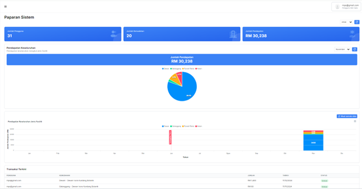

# **Paparan Sistem - Laman Utama**

- **Tujuan**: Membantu pengguna memahami dan menggunakan paparan utama sistem untuk mendapatkan gambaran keseluruhan statistik pengguna, kemudahan, pendapatan, dan transaksi terkini.

## **Bahagian dan Kandungan**

### **Paparan Sistem**

1. **Statistik Utama**

   - Jumlah Pengguna: Menunjukkan jumlah pengguna yang berdaftar di dalam sistem.
   - Jumlah Kemudahan: Memaparkan bilangan kemudahan yang tersedia untuk tempahan.
   - Jumlah Pendapatan: Anggaran pendapatan terkumpul berdasarkan semua tempahan yang telah dibuat.

2. **Carta Pendapatan Keseluruhan**

   - Menunjukkan jumlah pendapatan yang diraih melalui tempahan mengikut jenis kemudahan:
     - **Dewan**
     - **Gelanggang**
     - **Rumah Rehat**
     - **Kolam**
   - Carta pai memaparkan peratusan pendapatan mengikut kategori kemudahan.

3. **Graf Pendapatan Mengikut Jenis Kemudahan**

   - Memaparkan pendapatan bulanan yang dijana mengikut jenis kemudahan dalam bentuk graf garis.
   - Pengguna boleh memilih untuk menapis tahun atau bulan untuk melihat data tertentu.

4. **Transaksi Terkini**

   - Paparan senarai transaksi terakhir termasuk butiran seperti:
     - **Pengguna**: Alamat e-mel pengguna yang membuat tempahan.
     - **Kemudahan**: Nama kemudahan yang ditempah.
     - **Jumlah**: Nilai pembayaran bagi tempahan tersebut.
     - **Tarikh**: Tarikh tempahan dibuat.
     - **Status**: Status pembayaran (contohnya, _Berjaya_).
