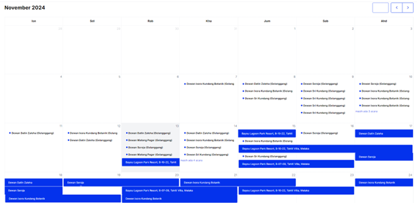
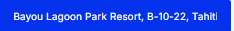
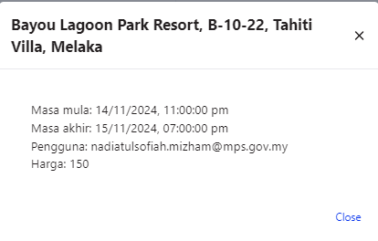

# **Kalendar**

- **Tujuan**: Panduan untuk menyemak tempahan kemudahan berdasarkan tarikh dalam paparan kalendar. Pengguna boleh menyemak butiran tempahan seperti tarikh, masa, dan maklumat pengguna.

---

## **Langkah-langkah**

### **1. Paparan Kalendar Tempahan**

1. **Navigasi Kalendar**:
   - Kalendar memaparkan semua tempahan mengikut bulan.
   - Tarikh dengan tempahan akan memaparkan nama kemudahan seperti *Dewan Datin Zaleha* atau *Bayou Lagoon Park Resort*.

   

2. **Navigasi Bulan**:
   - Gunakan ikon **<** dan **>** di sudut kanan atas kalendar untuk menukar bulan.

---

### **2. Semak Butiran Tempahan**

1. **Klik pada Nama Fasiliti**:
   - Pada tarikh tertentu, klik pada blok biru yang memaparkan nama fasiliti untuk melihat butiran lengkap tempahan.

   

2. **Butiran Tempahan**:
   - Pop-up akan dipaparkan dengan maklumat berikut:
     - **Nama Kemudahan**: Nama fasiliti yang ditempah.
     - **Masa Mula**: Tarikh dan masa tempahan bermula.
     - **Masa Akhir**: Tarikh dan masa tempahan tamat.
     - **Pengguna**: Alamat e-mel pengguna yang membuat tempahan.
     - **Harga**: Jumlah harga tempahan.

   

3. **Tutup Pop-up**:
   - Klik butang **Close** untuk menutup pop-up dan kembali ke paparan kalendar.
