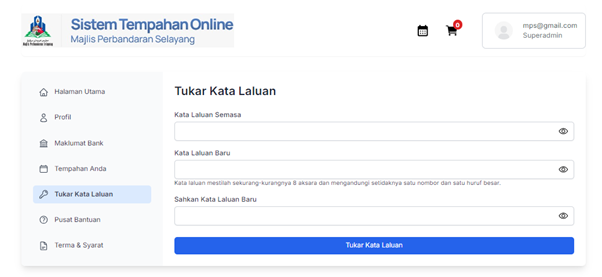

# Tukar Kata Laluan

- **Tujuan**: Memberi kemudahan kepada admin untuk menukar kata laluan bagi keselamatan akaun.

## Langkah-langkah

1. Pilih menu **Tukar Kata Laluan**.
2. Masukkan:
   - Kata laluan semasa
   - Kata laluan baru
   - Sahkan semula kata laluan baru
3. Klik **Tukar Kata Laluan** untuk menyimpan perubahan.

   
