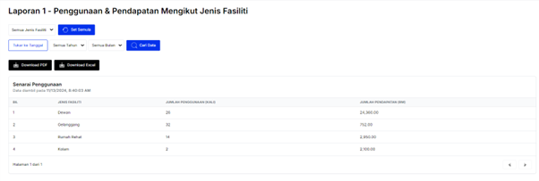
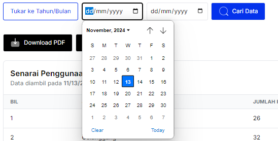
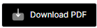

# **Laporan 1 - Penggunaan & Pendapatan Mengikut Jenis Fasiliti**

- **Tujuan**: Panduan untuk menyemak laporan penggunaan dan pendapatan setiap jenis fasiliti, serta memuat turun laporan dalam format PDF atau Excel.

## **Langkah-langkah**

### **1. Menyemak Laporan**

1. **Paparan Utama**:
   - Laporan memaparkan senarai jenis fasiliti dengan dua metrik utama:
     - **Jumlah Penggunaan**: Bilangan kali fasiliti digunakan.
     - **Jumlah Pendapatan (RM)**: Jumlah pendapatan yang dihasilkan daripada penggunaan fasiliti.

   

2. **Penapis Data**:
   - Gunakan penapis untuk memilih data tertentu:
     - **Jenis Fasiliti**: Pilih jenis fasiliti seperti *Dewan*, *Gelanggang*, *Rumah Rehat*, atau *Kolam*.
     - **Tahun/Bulan**: Tukar format untuk melihat laporan berdasarkan tahun atau bulan tertentu.
     - **Tarikh Mula dan Tamat**: Pilih tarikh spesifik menggunakan *date picker*.

   

3. **Cari Data**:
   - Klik butang **Cari Data** untuk memaparkan laporan berdasarkan penapis yang dipilih.

---

### **2. Muat Turun Laporan**

1. **Format Pilihan**:
   - **Download PDF**:
     - Klik butang hitam **Download PDF**  untuk memuat turun laporan dalam format PDF.
   - **Download Excel**:
     - Klik butang hitam **Download Excel**  untuk memuat turun laporan dalam format Excel.

2. **Simpan Fail**:
   - Fail laporan akan dimuat turun ke komputer anda dan boleh dibuka untuk semakan atau dikongsi dengan pihak berkaitan.