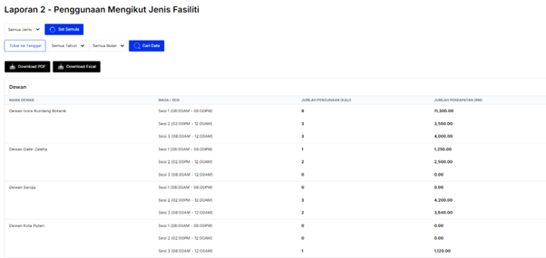
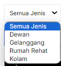
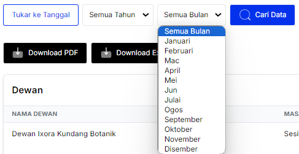

# **Laporan 2 - Penggunaan Mengikut Jenis Fasiliti**

- **Tujuan**: Panduan untuk menyemak laporan penggunaan fasiliti secara terperinci berdasarkan nama, sesi, jumlah penggunaan, dan pendapatan. Laporan ini membolehkan anda membuat analisis yang lebih mendalam.

---

## **Langkah-langkah**

### **1. Menyemak Laporan**

1. **Paparan Utama**:
   - Laporan disusun mengikut **Jenis Fasiliti** seperti *Dewan*, *Gelanggang*, *Rumah Rehat*, dan *Kolam*.
   - Untuk setiap fasiliti:
     - **Nama Fasiliti**: Nama spesifik seperti *Dewan Ixora Kundang Botanik*.
     - **Masa/Sesi**: Sesi masa penggunaan fasiliti (contoh: *Sesi 1: 08:00AM - 06:00PM*).
     - **Jumlah Penggunaan (Kali)**: Bilangan kali fasiliti digunakan dalam sesi tersebut.
     - **Jumlah Pendapatan (RM)**: Pendapatan yang diperoleh dari sesi tersebut.

   

---

### **2. Penapisan Data**

1. **Jenis Fasiliti**:
   - Klik menu drop-down **Semua Jenis** untuk memilih fasiliti tertentu seperti:
     - *Dewan*
     - *Gelanggang*
     - *Rumah Rehat*
     - *Kolam*

   

2. **Tahun dan Bulan**:
   - **Tahun**: Pilih tahun tertentu untuk memaparkan data.
   - **Bulan**: Pilih bulan spesifik (contoh: *November*) untuk menapis data.

   

3. **Tarikh Spesifik**:
   - Klik **Tukar ke Tanggal** untuk menapis data berdasarkan tarikh mula dan tarikh tamat tertentu.
   - Gunakan pemilih tarikh (*date picker*) untuk memilih julat tarikh.

4. **Cari Data**:
   - Klik butang biru **Cari Data** untuk memaparkan laporan berdasarkan parameter yang dipilih.

---

### **3. Muat Turun Laporan**

1. **Format Pilihan**:
   - **Download PDF**:
     - Klik butang hitam **Download PDF** untuk memuat turun laporan dalam format PDF.
   - **Download Excel**:
     - Klik butang hitam **Download Excel** untuk memuat turun laporan dalam format Excel.

2. **Simpan Fail**:
   - Fail laporan akan disimpan ke peranti anda untuk kegunaan semakan atau pembentangan.
