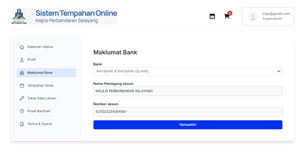

# Maklumat Bank

- **Tujuan**: Mengemas kini maklumat bank untuk tujuan pemulangan cagaran.

## Langkah-langkah

1. Pilih menu **Maklumat Bank** dari panel sebelah kiri.
2. Masukkan atau kemas kini maklumat:
   - Nama bank
   - Nama pemegang akaun
   - Nombor akaun
3. Klik butang **Kemas Kini** untuk menyimpan maklumat bank.
   
