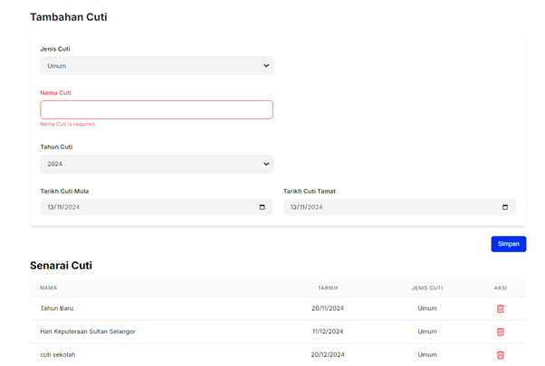
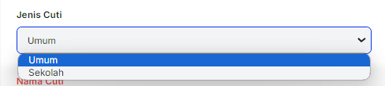

# **Pengurusan Cuti**

- **Tujuan**: Panduan untuk menguruskan maklumat cuti dalam sistem, termasuk menambah, mengedit, dan memadam cuti seperti cuti umum dan cuti sekolah.

## **Langkah-langkah**

### **1. Menambah Cuti**

1. **Pilih Jenis Cuti**:

   - Klik menu drop-down **Jenis Cuti** dan pilih:
     - **Umum**: Untuk cuti yang melibatkan semua pengguna.
     - **Sekolah**: Untuk cuti khas yang berkaitan dengan jadual sekolah.

   

2. **Isi Nama Cuti**:

   - Masukkan nama cuti dalam medan **Nama Cuti**. (Contoh: _Hari Kebangsaan_).
   - Medan ini wajib diisi; jika kosong, mesej "Nama Cuti is required" akan dipaparkan.

3. **Pilih Tahun Cuti**:

   - Gunakan menu drop-down untuk memilih tahun cuti.

4. **Tetapkan Tarikh Cuti**:

   - Pilih **Tarikh Cuti Mula** dan **Tarikh Cuti Tamat** menggunakan pemilih tarikh (date picker).
   - Jika cuti hanya sehari, masukkan tarikh yang sama pada kedua-dua medan.

5. **Klik Simpan**:

   - Tekan butang **Simpan** untuk menambah cuti baru ke dalam sistem.

---

### **2. Senarai Cuti**

1. **Semak Senarai Cuti**:

   - Semua cuti yang telah ditambah akan disenaraikan di bahagian **Senarai Cuti**.
   - Maklumat yang dipaparkan termasuk:
     - **Nama Cuti**
     - **Tarikh** (mula hingga tamat)
     - **Jenis Cuti**

   

2. **Aksi**:
   - **Padam Cuti**:
     - Klik ikon tong sampah merah  di ruangan **Aksi** untuk memadam cuti.
     - Sistem akan memaparkan pengesahan sebelum pemadaman.
