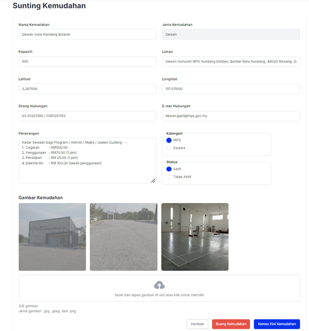

# **Pengurusan Kemudahan**

- **Tujuan**: Panduan untuk menguruskan kemudahan yang tersedia di dalam sistem, termasuk menyunting butiran kemudahan, menetapkan harga, dan menambah kemudahan baru.

## **Langkah-langkah**

### **1. Paparan Utama Kemudahan**

Pada bahagian ini, anda dapat melihat:

- **Jumlah Kemudahan**: Menunjukkan bilangan keseluruhan kemudahan.
- **Aktif**: Bilangan kemudahan yang tersedia untuk tempahan.
- **Tidak Aktif**: Bilangan kemudahan yang belum tersedia untuk tempahan.

#### **Senarai Kemudahan**

- Senarai lengkap kemudahan dengan butiran seperti:
  - Nama kemudahan
  - Lokasi
  - Jenis kemudahan (contohnya: Dewan, Gelanggang)
  - Status (Aktif/Tidak Aktif)
- Tindakan yang boleh dilakukan:
  - **Edit**: Untuk menyunting butiran kemudahan.
  - **Harga**: Untuk menetapkan harga tempahan kemudahan.

### **2. Menyunting Kemudahan**

1. Klik butang **Edit** pada kemudahan yang ingin disunting.

   

2. Halaman **Sunting Kemudahan** akan dipaparkan, dengan butiran berikut yang boleh dikemaskini:

   

   - **Nama Kemudahan**: Nama penuh kemudahan (contoh: Dewan Ixora Kundang Botanik).
   - **Jenis Kemudahan**: Jenis kemudahan seperti Dewan, Gelanggang, dan sebagainya.
   - **Lokasi**: Alamat lengkap lokasi kemudahan.
   - **Kapasiti**: Jumlah maksimum kapasiti kemudahan.
   - **Latitud & Longitud**: Koordinat GPS kemudahan.
   - **Orang Hubungan**: Nombor telefon pegawai bertanggungjawab.
   - **E-mel Hubungan**: Alamat e-mel pegawai bertanggungjawab.
   - **Penerangan**: Perincian berkenaan kadar sewaan, tempoh penggunaan, dan caj lain seperti elektrik dan air.
   - **Kategori**: Sama ada kemudahan dikendalikan oleh MPS atau pihak swasta.
   - **Status**: Pilihan untuk menetapkan kemudahan sebagai _Aktif_ atau _Tidak Aktif_.

3. Untuk menukar gambar kemudahan:

   - Seret dan lepaskan gambar ke bahagian yang disediakan atau klik untuk memilih gambar daripada komputer.
   - Jenis gambar yang disokong: _.jpg, .jpeg, .png._

4. Klik **Kemas Kini Kemudahan** untuk menyimpan perubahan.

   

### **3. Menetapkan Harga Kemudahan**

1. Klik butang **Harga** pada kemudahan yang ingin disunting.

   

### **4. Konfigurasi Harga Kemudahan**

#### **Dewan**

Untuk jenis kemudahan _Dewan_, konfigurasi harga boleh diisi berdasarkan kategori pengguna dan sesi:

- **Hari Biasa dan Cuti Sekolah**:

  - Tetapkan harga bagi setiap sesi (contoh: Sesi 1, Sesi 2, dan Sesi 3).
  - Kategori pengguna yang boleh diisi:
    - **Kakitangan MPS**
    - **Ahli Majlis**
    - **Khas**
    - **Pengguna Awam**

- **Lain-lain Caj**:
  - **Persiapan**: Caj bagi waktu persediaan.
  - **Cagaran**: Deposit wajib untuk tempahan.
  - **Elektrik/Air**: Caj tambahan untuk kemudahan elektrik atau air.

Setelah maklumat dimasukkan, klik **Simpan Harga**.

---

#### **Gelanggang**

Untuk _Gelanggang_, harga boleh ditetapkan berdasarkan jenis hari:

- **Hari Biasa**:
  - Harga untuk tempahan pada hari kerja.
- **Sabtu/Ahad/Cuti Umum**:
  - Harga bagi tempahan pada hujung minggu atau cuti umum.

Setelah harga diisi, klik **Simpan Harga** untuk menyimpan tetapan.

---

#### **Rumah Rehat**

Untuk _Rumah Rehat_, harga disusun berdasarkan jenis pengguna dan hari tertentu:

- **Kategori Pengguna**:
  - **Kakitangan MPS**
  - **Ahli Majlis**
  - **Khas**
  - **Pengguna Awam**
- **Hari Biasa dan Cuti**:
  - Tetapkan harga mengikut kategori pengguna untuk hari biasa dan hari-hari istimewa seperti Jumaat, Sabtu, Cuti Umum, atau Cuti Sekolah.
- **Cagaran**:
  - Tetapkan deposit yang diperlukan.

Klik **Simpan Harga** setelah semua maklumat dimasukkan.

---

#### **Kolam**

Untuk _Kolam_, konfigurasi harga boleh ditetapkan mengikut sesi dan kategori:

- **Kategori Kolam**:
  - Contohnya: Kolam Kanak-kanak, Kolam Dewasa.
- **Harga Setiap Sesi**:
  - Tetapkan harga untuk setiap sesi seperti Sesi 1 dan Sesi 2.
- **Lain-lain Caj**:
  - **Persiapan**: Caj persediaan.
  - **Elektrik/Air**: Caj tambahan untuk penggunaan elektrik dan air.

Selepas selesai mengisi, klik **Simpan Harga**.