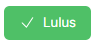

# **Pengurusan Tempahan Kolam**

- **Tujuan**: Panduan untuk mengurus permohonan tempahan kolam yang dihantar oleh pengguna. Panduan ini merangkumi semakan, kelulusan, dan pembatalan permohonan.

## **Langkah-langkah**

### **1. Paparan Permohonan Tempahan Kolam**

   

1. **Jumlah Permintaan**:
   - Paparan jumlah keseluruhan permohonan tempahan kolam yang diterima.
2. **Senarai Permohonan**:
   - Senarai permohonan termasuk:
     - **Nama Kemudahan**: Kolam yang dimohon.
     - **Pengguna**: E-mel pengguna yang menghantar permohonan.
     - **Status**: Status permohonan (*Ditolak*, *Menunggu Kelulusan*, atau *Diluluskan*).

3. **Tindakan**:
   - Klik butang **Lihat**  untuk melihat butiran penuh permohonan.

---

### **2. Menyemak Butiran Permohonan**

1. Klik **Lihat** pada permohonan yang ingin disemak.
2. Halaman **Butiran Permohonan** akan memaparkan maklumat berikut:
   - **Jenis dan Nama Fasiliti**: Contoh: *Kolam Renang Seri Siantan*.
   - **Tarikh & Masa**:
     - Mula: Tarikh dan waktu permohonan bermula.
     - Tamat: Tarikh dan waktu permohonan berakhir.
   - **Jenis Sewaan**:
     - Contoh: Sewaan Lane (Satu Lane).
     - **Lane**: Jumlah lane yang dipohon.
   - **Butiran Caj**:
     - Caj Sewaan, Persiapan, dan Perkhidmatan.
     - Jumlah Harga keseluruhan.
   - **Tujuan**: Keterangan ringkas mengenai tujuan tempahan.
   - **Pengguna**: Alamat e-mel pengguna yang membuat permohonan.

   

---

### **3. Kelulusan atau Pembatalan Permohonan**

1. Setelah menyemak butiran permohonan, terdapat dua tindakan utama:
   - **Lulus**:
     - Klik butang hijau **Lulus** 
     - Pengguna akan menerima e-mel pengesahan bahawa permohonan mereka telah diluluskan.
   - **Batal**:
     - Klik butang merah **Batal** 
     - Pengguna akan menerima e-mel pemberitahuan bahawa permohonan mereka telah ditolak.

2. **Kembali ke Senarai**:
   - Klik **Kembali** untuk kembali ke senarai permohonan tanpa membuat sebarang tindakan.
