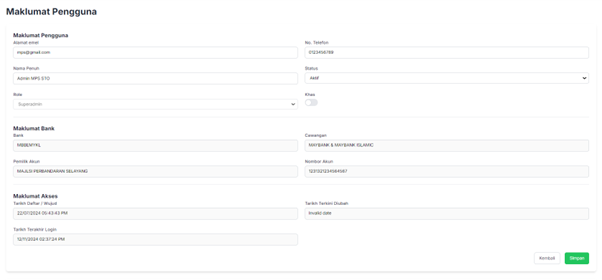
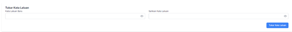

# **Pengurusan Pengguna**

- **Tujuan**: Panduan untuk menguruskan pengguna dalam sistem, termasuk menyunting maklumat pengguna, menetapkan peranan, mengaktifkan atau menyahaktifkan pengguna, dan menukar kata laluan.

## **Langkah-langkah**

### **1. Paparan Utama Pengguna**

Pada bahagian ini, anda dapat melihat statistik dan senarai pengguna:

- **Jumlah Pengguna**: Bilangan pengguna yang berdaftar dalam sistem.
- **Aktif**: Pengguna yang sedang aktif.
- **Tidak Aktif**: Pengguna yang tidak aktif.
- **Khas**: Bilangan pengguna dengan status "Khas".

#### **Senarai Pengguna**

- Memaparkan butiran seperti:
  - Nama pengguna
  - Alamat e-mel pengguna
  - Jenis pengguna (contohnya: _Awam_, _Kakitangan MPS_, _Superadmin_).
  - Status pengguna (contohnya: _Aktif_).
- **Aksi**:
  - Klik butang **Edit**  untuk menyunting maklumat pengguna.

### **2. Menyunting Maklumat Pengguna**

1. Klik **Edit** pada pengguna yang ingin dikemaskini.

   

2. Anda akan diarahkan ke halaman **Maklumat Pengguna**. Maklumat berikut boleh dikemaskini:

   - **Alamat E-mel**: Alamat e-mel pengguna.
   - **Nama Penuh**: Nama lengkap pengguna.
   - **No. Telefon**: Nombor telefon pengguna.
   - **Status**: Tetapkan sama ada pengguna _Aktif_ atau _Tidak Aktif_.
   - **Role (Peranan)**: Pilih peranan pengguna daripada senarai:
     - _Awam_
     - _Kakitangan MPS_
     - _Superadmin_

3. **Maklumat Bank**:

   - Isi maklumat akaun bank pengguna jika diperlukan:
     - Nama bank
     - Cawangan bank
     - Nombor akaun
     - Pemilik akaun

4. **Maklumat Akses**:

   - Lihat butiran akses pengguna seperti:
     - Tarikh daftar
     - Tarikh terakhir log masuk

5. Klik **Simpan** untuk menyimpan sebarang perubahan.

### **3. Tukar Kata Laluan Apabila "Khas" Diaktifkan**

1. **Aktifkan Status "Khas"**:

   - Setelah togol "Khas" diaktifkan, borang untuk **Tukar Kata Laluan** akan dipaparkan secara automatik.

   

2. **Isi Kata Laluan Baru**:

   - Masukkan kata laluan baru di medan **Kata Laluan Baru**.
   - Masukkan semula kata laluan yang sama di medan **Sahkan Kata Laluan**.

3. **Simpan Perubahan**:

   - Klik **Tukar Kata Laluan** untuk menetapkan kata laluan baru.
   - Pastikan kata laluan baru disahkan berjaya sebelum kembali ke bahagian lain.

4. Setelah selesai, klik **Simpan** untuk mengemaskini maklumat pengguna berserta status "Khas".
