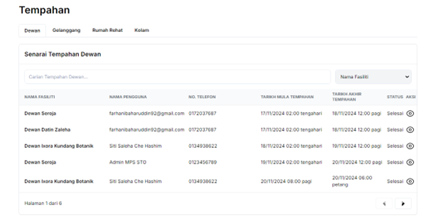
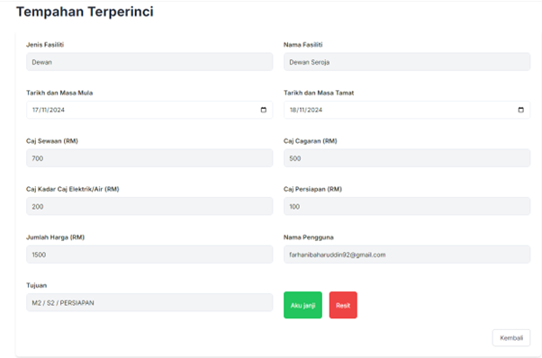
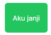
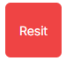
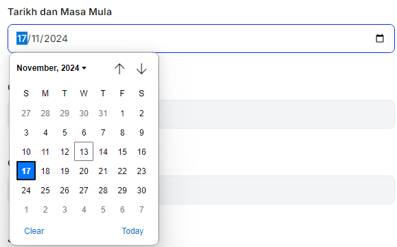

# **Tempahan**

- **Tujuan**: Panduan untuk mengurus tempahan kemudahan seperti dewan, gelanggang, rumah rehat, dan kolam. Panduan ini merangkumi semakan senarai tempahan, melihat butiran tempahan, memuat turun dokumen penting, dan mengemaskini maklumat tempahan.

## **Langkah-langkah**

### **1. Senarai Tempahan**

1. **Pilih Jenis Kemudahan**:
   - Klik tab yang sesuai seperti **Dewan**, **Gelanggang**, **Rumah Rehat**, atau **Kolam** untuk melihat senarai tempahan berdasarkan jenis kemudahan.

2. **Semakan Senarai Tempahan**:
   - Paparan senarai tempahan menunjukkan maklumat seperti:
     - **Nama Fasiliti**: Kemudahan yang ditempah.
     - **Nama Pengguna**: Nama pengguna yang membuat tempahan.
     - **No. Telefon**: Nombor telefon pengguna.
     - **Tarikh Mula dan Tamat Tempahan**: Tempoh tempahan.
     - **Status Tempahan**: Contoh: *Selesai* atau *Dalam Proses*.

   

3. **Cari Tempahan**:
   - Gunakan medan **Carian Tempahan** untuk mencari tempahan berdasarkan nama fasiliti atau pengguna.

4. **Lihat Butiran Tempahan**:
   - Klik ikon **Mata**  pada ruangan **Aksi** untuk melihat butiran terperinci tempahan.

---

### **2. Butiran Tempahan**

1. **Semak Maklumat Tempahan**:
   - Setelah klik ikon **Mata**, paparan **Tempahan Terperinci** akan menunjukkan butiran berikut:
     - **Jenis dan Nama Fasiliti**: Contoh: Dewan Seroja.
     - **Tarikh dan Masa**: Tarikh mula dan tamat tempahan.
     - **Butiran Caj**:
       - Caj Sewaan, Caj Kadar Elektrik/Air, Caj Cagaran, dan Caj Persiapan.
       - **Jumlah Harga**: Jumlah keseluruhan caj.
     - **Tujuan**: Keterangan tujuan tempahan.
     - **Nama Pengguna**: Nama dan e-mel pengguna yang membuat tempahan.

   

2. **Dokumen Penting**:
   - **Aku Janji**:
     - Klik butang hijau **Aku Janji**  untuk memuat turun dokumen aku janji tempahan.
   - **Resit**:
     - Klik butang merah **Resit**  untuk memuat turun resit pembayaran tempahan.

3. **Kemaskini Maklumat Tempahan**:
   - Klik medan tarikh/maklumat untuk mengubah maklumat tempahan jika perlu. Contohnya:
     - Tarikh dan masa mula/tamat.
     - Caj persiapan atau caj lain.
   - Klik **Simpan** untuk menyimpan perubahan.

   

4. **Kembali ke Senarai**:
   - Klik butang **Kembali** untuk kembali ke senarai tempahan.

