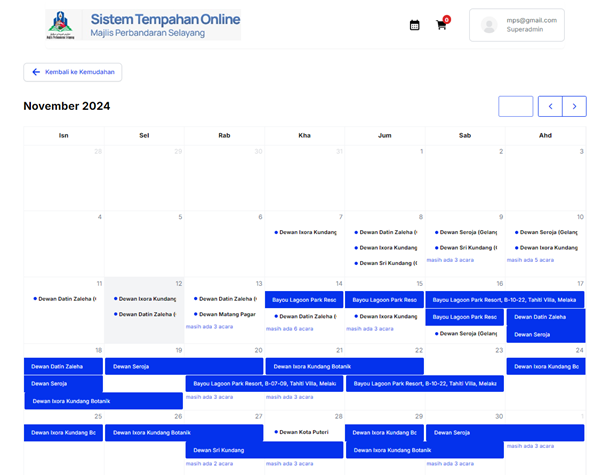

# Kalendar Tempahan

- **Tujuan**: Membantu pengguna menyemak ketersediaan kemudahan berdasarkan tarikh yang dipilih.

## Langkah-langkah

1.  Pada halaman kalendar tempahan, pengguna boleh melihat jadual tempahan untuk kemudahan yang dipilih. Setiap tempahan akan ditandakan dalam kalendar berdasarkan tarikh dan masa yang telah ditempah.

    

2.  Untuk melihat bulan lain, klik anak panah kiri atau kanan di bahagian atas kanan kalendar untuk mengubah bulan.

## Pengendalian Ralat

- Jika tiada tempahan ditemui dalam kalendar untuk bulan atau hari yang dipilih, semak kembali tarikh atau jenis kemudahan yang sedang dilihat.
