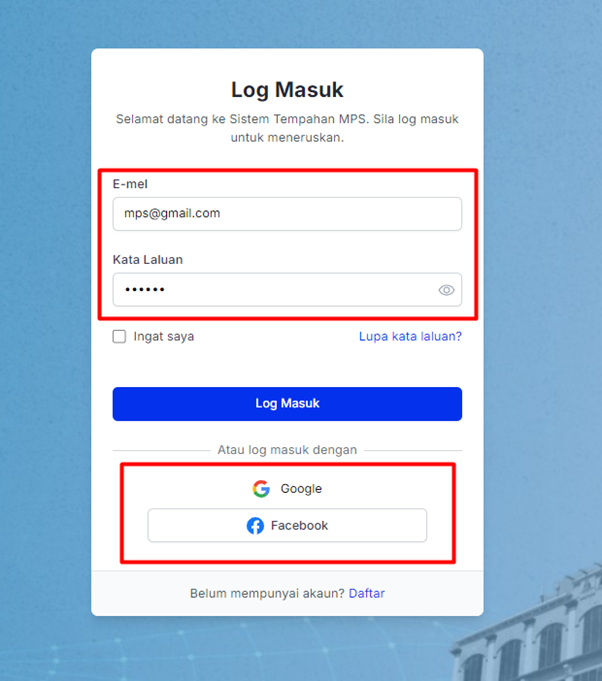

# Log Masuk Pengguna

- **Tujuan**: Panduan untuk log masuk ke dalam sistem tempahan.

## Langkah-langkah

1.  Pada halaman log masuk, masukkan:
    - **E-mel**: E-mel yang didaftarkan.
    - **Kata Laluan**: Kata laluan akaun anda.
    - Tandakan kotak **"Ingat saya"** jika ingin menyimpan maklumat log masuk anda untuk akses mudah di masa akan datang.
    - Klik **Log Masuk**.
2.  Pilihan log masuk lain tersedia dengan **Google** atau **Facebook**. Klik pada salah satu ikon untuk log masuk melalui akaun tersebut.

    
