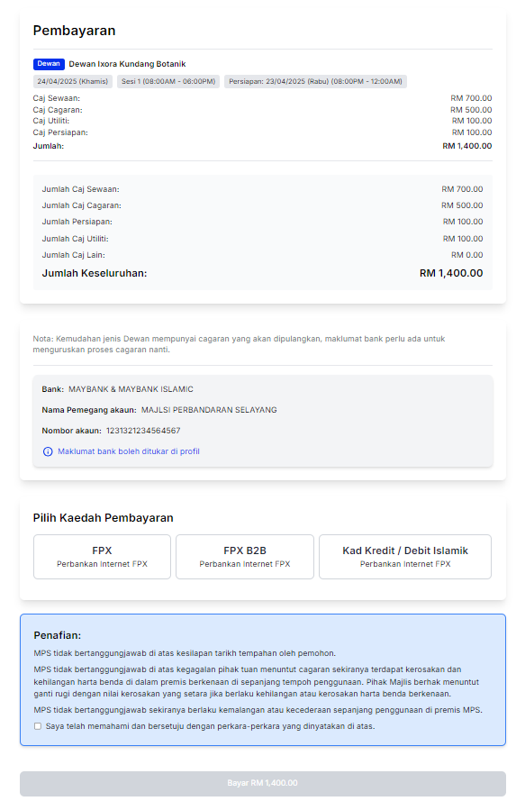
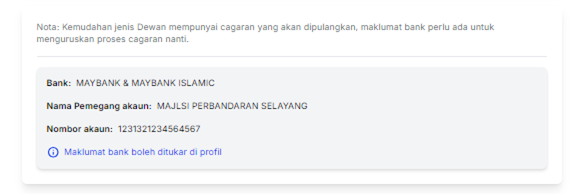
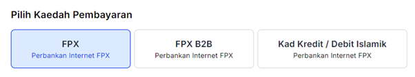
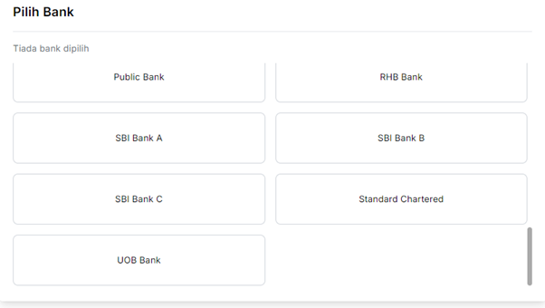
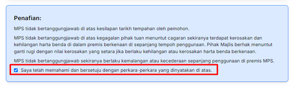
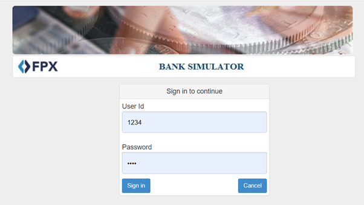
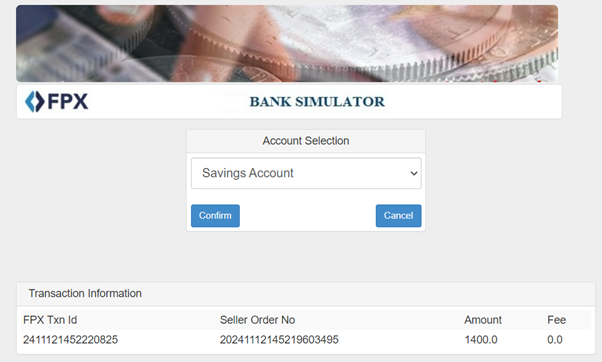

# Pembayaran

- **Tujuan**: Panduan untuk melengkapkan pembayaran bagi tempahan yang telah disahkan dalam troli.

## Langkah-langkah

1.  Pada halaman **Pembayaran**, semak butiran tempahan termasuk caj sewaan, caj cagaran, caj utiliti, dan jumlah keseluruhan.

    

2.  **Nota tentang Cagaran**: Kemudahan jenis _Dewan_ memerlukan cagaran yang akan dipulangkan kepada pengguna selepas tempahan selesai. Oleh itu, pengguna perlu memasukkan maklumat akaun bank untuk memudahkan proses pemulangan cagaran. Maklumat ini termasuk:

    - **Bank**: Nama bank tempat akaun berdaftar.
    - **Nama Pemegang Akaun**: Nama penuh pemegang akaun bank.
    - **Nombor Akaun**: Nombor akaun bank untuk pemulangan cagaran.
    - Jika pengguna perlu mengubah maklumat bank, klik pautan **Maklumat bank boleh ditukar di profil**.

      

3.  Pilih kaedah pembayaran dari pilihan yang tersedia, seperti **FPX**, **FPX B2B**, atau **Kad Kredit/Debit Islamik**.

    

4.  Pilih bank yang sesuai dari senarai bank yang disediakan.

    

5.  Tanda kotak **Saya telah memahami dan bersetuju dengan perkara-perkara yang dinyatakan di atas** untuk menerima terma dan syarat.

    

6.  Klik butang **Bayar [Jumlah]** untuk meneruskan proses pembayaran.

    

## Pengendalian Ralat

- Jika pembayaran gagal, pengguna akan menerima notifikasi ralat. Sila pastikan maklumat bank atau kaedah pembayaran dipilih dengan betul sebelum mencuba lagi.

## Pembayaran FPX

### Langkah-langkah

1.  Setelah memilih **FPX** sebagai kaedah pembayaran, pengguna akan diarahkan ke halaman bank yang terpilih.
2.  Masukkan **User ID** dan **Password** untuk log masuk ke akaun bank.

    

3.  Pilih jenis akaun (contohnya **Savings Account**), kemudian klik **Confirm** untuk mengesahkan pembayaran.

    

4.  Selepas pembayaran berjaya, pengguna akan diarahkan semula ke sistem dengan notifikasi bahawa pembayaran telah berjaya.
