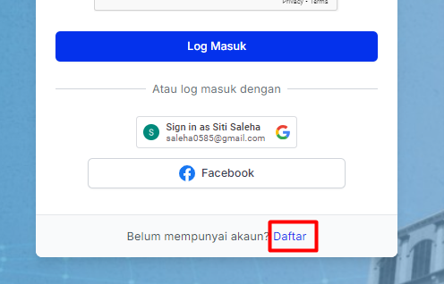
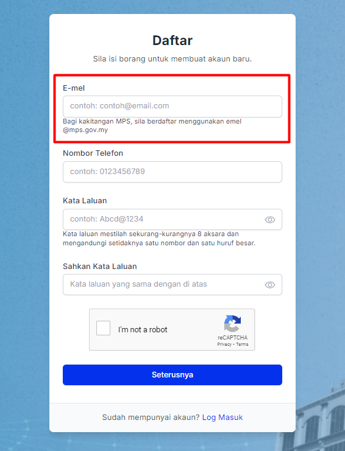
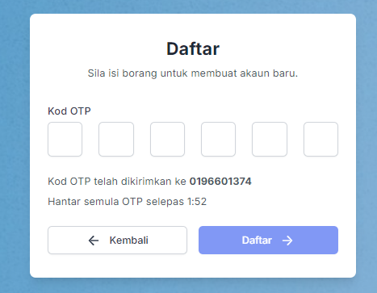
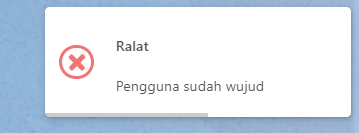
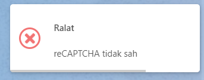

# Pendaftaran Pengguna Baharu

- **Tujuan**: Membantu pengguna baharu untuk mendaftar akaun dalam sistem.

## Langkah-langkah

1.  Pergi ke halaman log masuk sistem dan klik pautan **"Daftar"** di bahagian bawah.

    

2.  Pada borang pendaftaran, masukkan maklumat berikut:

    - **E-mel**: Masukkan alamat e-mel yang sah. _Nota: Bagi kakitangan MPS, sila gunakan e-mel yang berakhir dengan "@mps.gov.my"._
    - **Nombor Telefon**: Masukkan nombor telefon bimbit yang aktif.
    - **Kata Laluan**: Kata laluan mesti sekurang-kurangnya 8 aksara dan mengandungi sekurang-kurangnya satu nombor dan satu huruf besar.
    - **Sahkan Kata Laluan**: Masukkan semula kata laluan untuk pengesahan.
    - **reCAPTCHA**: Tandakan kotak reCAPTCHA untuk membuktikan anda bukan robot.
    - Klik butang **Seterusnya** untuk meneruskan.

      

3.  Sistem akan menghantar Kod OTP ke nombor telefon yang didaftarkan. Masukkan kod OTP tersebut dalam medan yang disediakan dan klik **Daftar** untuk menyelesaikan proses.

    

## Pengendalian Ralat

- Jika terdapat ralat "Pengguna sudah wujud", ini bermakna e-mel yang dimasukkan telah digunakan untuk akaun lain. Sila gunakan e-mel lain atau log masuk dengan e-mel yang sedia ada.

  

- Jika reCAPTCHA tidak sah, pastikan anda menandakan kotak reCAPTCHA dengan betul sebelum meneruskan.

  
