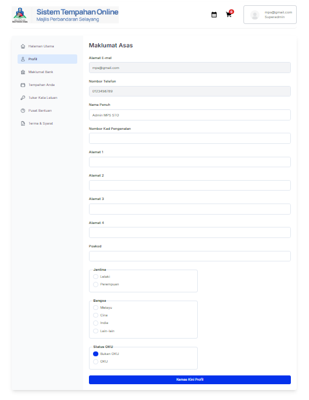

# Profil Pengguna

- **Tujuan**: Membolehkan admin untuk mengemas kini maklumat peribadi dalam profil.

## Langkah-langkah

1. Pada panel sebelah kiri, klik pada menu **Profil**.
2. Halaman **Maklumat Asas** akan memaparkan butiran seperti:
   - Alamat e-mel
   - Nombor telefon
   - Nama penuh
   - Nombor kad pengenalan
   - Alamat
   - Jantina
   - Bangsa
   - Status OKU
3. Admin boleh mengemas kini maklumat yang diperlukan dan klik butang **Kemas Kini Profil** untuk menyimpan perubahan.

   
