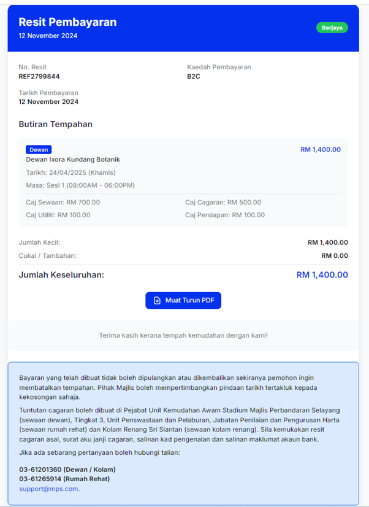
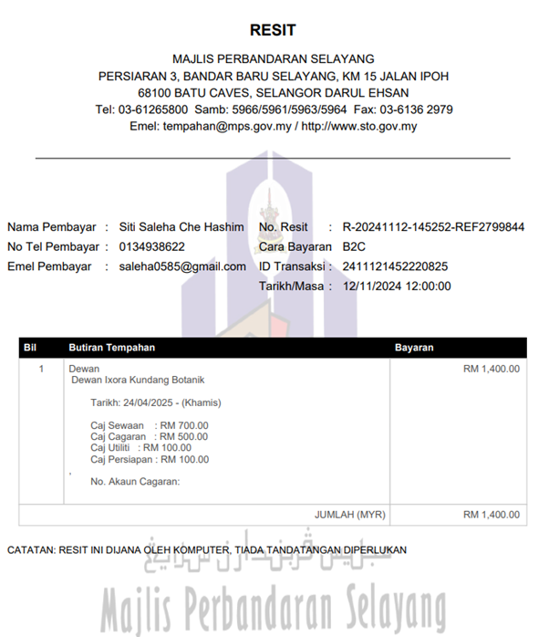

# Resit Pembayaran

- **Tujuan**: Membantu pengguna menyemak dan menyimpan resit pembayaran sebagai bukti tempahan.

## Langkah-langkah

1.  Setelah pembayaran berjaya, halaman **Resit Pembayaran** akan dipaparkan, memaparkan butiran tempahan, jumlah bayaran, dan kaedah pembayaran yang digunakan.
    
2.  Klik **Muat Turun PDF** untuk menyimpan resit dalam format PDF sebagai rekod.
    
3.  Jika perlu, pengguna juga boleh mencetak resit ini untuk kegunaan rekod fizikal.
4.  Sistem akan memaparkan resit tambahan dengan maklumat lengkap transaksi, termasuk ID transaksi dan maklumat pembayaran.
    
