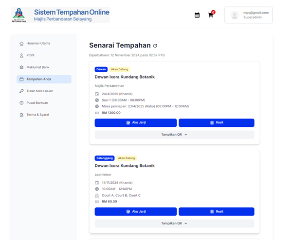
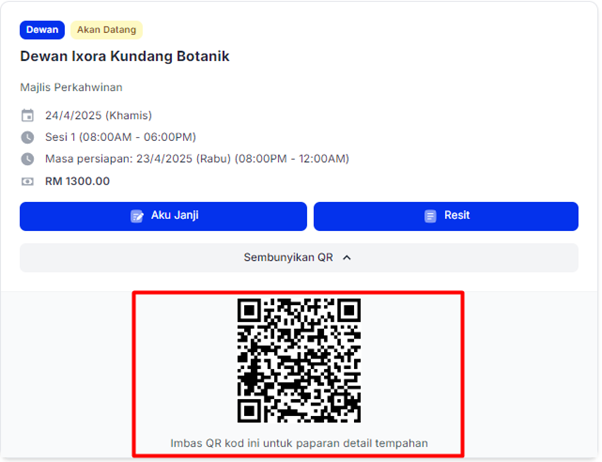

# Senarai Tempahan

- **Tujuan**: Menyemak semua tempahan yang telah dibuat oleh pengguna atau admin sendiri, serta memaparkan kod QR untuk akses pantas ke butiran tempahan.

## Langkah-langkah

1.  Pada menu utama di sebelah kiri, pilih **Tempahan Anda** untuk melihat senarai tempahan yang ada.

    

2.  Setiap tempahan akan dipaparkan dengan butiran seperti:
    - Nama kemudahan yang ditempah (contohnya, Dewan Ixora Kundang Botanik).
    - Tujuan tempahan (contohnya, Majlis Perkahwinan).
    - Tarikh, masa tempahan, dan masa persiapan.
    - Jumlah bayaran yang telah dikenakan.
3.  Pada setiap tempahan, terdapat beberapa pilihan untuk tindakan lanjut:

    - Klik butang **Aku Janji** untuk memuat turun dokumen perjanjian tempahan.

      

    - Klik butang **Resit** untuk memuat turun resit pembayaran bagi tempahan tersebut.

      

4.  Untuk memaparkan kod QR tempahan, klik pada **Tampilkan QR**. Kod QR akan muncul di bawah butiran tempahan. Kod ini membolehkan pengguna atau petugas mengimbas untuk akses pantas kepada butiran tempahan.

    
