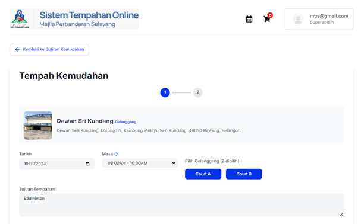

# Tempahan

- **Tujuan**: Membantu pengguna menyemak kemudahan yang tersedia dan membuat tempahan fasiliti yang diingini.

## Langkah-langkah

1.  Pada halaman utama tempahan, pengguna boleh mencari kemudahan yang diinginkan dengan menaip nama kemudahan dalam kotak **"Cari kemudahan..."** atau memilih jenis kemudahan menggunakan menu dropdown **"Semua Jenis"**.

    

2.  Kemudahan yang terdapat di bawah pilihan yang dibuat akan dipaparkan dalam bentuk kad yang mengandungi maklumat ringkas seperti nama kemudahan, kadar sewaan, maklumat penghubung, serta butang **Butiran** dan **Tempah**.

    

3.  Klik butang **Butiran** pada kad kemudahan yang diinginkan untuk melihat maklumat lanjut seperti spesifikasi, kapasiti, kadar sewaan, dan lokasi dengan peta interaktif.

    

4.  Untuk membuat tempahan, klik **Tempah Sekarang** di bahagian bawah halaman maklumat penuh kemudahan.

    

## Pengendalian Ralat

- Jika kemudahan yang dicari tidak ditemui, pastikan ejaan nama kemudahan betul atau cuba kategori kemudahan lain dalam menu dropdown **"Semua Jenis"**.

## Dewan

- **Tujuan**: Panduan untuk mengisi borang tempahan kemudahan dengan maklumat tarikh, masa, dan tujuan tempahan.

### Langkah-langkah

1.  Pada halaman butiran kemudahan, klik butang **Tempah** untuk membuka borang tempahan.

    

2.  Pilih tarikh tempahan dengan mengklik medan **Tarikh** dan memilih tarikh dari kalendar yang muncul.

    

3.  Pilih sesi masa tempahan dari menu dropdown **Masa**. Sesi masa yang tersedia adalah seperti berikut:

    - Sesi 1: 08:00 AM - 06:00 PM
    - Sesi 2: 02:00 PM - 12:00 AM
    - Sesi 3: 08:00 AM - 12:00 AM

      

4.  Pilih **Pilihan Persiapan** dengan memilih sama ada "Ada" atau "Tiada" untuk menentukan jika persiapan tambahan diperlukan.
5.  Dalam medan **Tujuan Tempahan**, nyatakan tujuan atau acara yang akan diadakan di kemudahan tersebut.
6.  Baca dan semak catatan di bahagian bawah borang mengenai syarat-syarat tempahan untuk pelbagai jenis kemudahan seperti Dewan, Gelanggang, Kolam, dan Rumah Rehat.
7.  Klik butang **Seterusnya** untuk melanjutkan ke langkah seterusnya bagi mengesahkan dan melengkapkan tempahan.

    

8.  Pada halaman **Ringkasan Tempahan**, semak semua maklumat tempahan seperti kemudahan yang dipilih, tarikh, masa, tujuan tempahan, caj sewaan, caj cagaran, caj utiliti, dan pilihan persiapan.

    

9.  Klik butang **Tambah ke Troli** untuk menyimpan tempahan ini ke dalam troli sebelum melanjutkan ke pembayaran.

    

10. Notifikasi akan dipaparkan untuk mengesahkan bahawa tempahan berjaya ditambahkan ke troli. Pengguna boleh memilih untuk **Lihat Troli** atau **Tutup** notifikasi tersebut.
    

### Pengendalian Ralat

- Pastikan semua medan wajib diisi. Sistem akan mengeluarkan mesej ralat jika terdapat medan yang kosong atau maklumat tidak lengkap.

## Gelanggang

- **Tujuan**: Panduan untuk mengisi borang tempahan gelanggang dengan maklumat tarikh, masa, dan tujuan tempahan.

### Langkah-langkah

1. Pada halaman butiran gelanggang, klik butang **Tempah** untuk membuka borang tempahan.

   

2. Pilih tarikh tempahan dengan mengklik medan **Tarikh** dan memilih tarikh dari kalendar yang muncul.

   

3. Pilih sesi masa tempahan dari menu dropdown **Masa**. Sesi masa yang tersedia adalah seperti berikut:

   - 08:00 AM - 10:00 AM
   - 10:00 AM - 12:00 PM
   - 12:00 PM - 02:00 PM
   - 02:00 PM - 04:00 PM
   - 04:00 PM - 06:00 PM
   - 06:00 PM - 08:00 PM
   - 08:00 PM - 10:00 PM
   - 10:00 PM - 12:00 AM

     

4. Pilih gelanggang yang ingin ditempah. Klik pada butang **Court A**, **Court B**, atau gelanggang lain yang tersedia.

   

5. Dalam medan **Tujuan Tempahan**, nyatakan tujuan atau acara yang akan diadakan di gelanggang tersebut (contohnya, Badminton).

6. Setelah semua maklumat diisi, klik butang **Seterusnya** untuk melanjutkan ke langkah pengesahan tempahan.

   

7. Pada halaman **Ringkasan Tempahan**, semak semua maklumat tempahan seperti tarikh, masa, gelanggang dipilih, jumlah gelanggang, dan tujuan.

   

8. Klik butang **Tambah ke Troli** untuk menyimpan tempahan ini ke dalam troli sebelum melanjutkan ke pembayaran.

   

9. Notifikasi akan dipaparkan untuk mengesahkan bahawa tempahan berjaya ditambahkan ke troli. Pengguna boleh memilih untuk **Lihat Troli** atau **Tutup** notifikasi tersebut.
   

### Pengendalian Ralat

- Pastikan semua medan yang wajib diisi telah dilengkapkan. Sistem akan mengeluarkan mesej ralat jika terdapat medan yang kosong atau maklumat tidak lengkap.
- Jika gelanggang yang dipilih tidak tersedia pada tarikh atau masa tertentu, pengguna perlu memilih sesi atau gelanggang yang lain.

## Rumah Rehat

- **Tujuan**: Panduan untuk mengisi borang tempahan rumah rehat dengan maklumat tarikh masuk, tarikh keluar, dan tujuan tempahan.

### Langkah-langkah

1. Pada halaman butiran rumah rehat, klik butang **Tempah** untuk membuka borang tempahan.

   

2. Pilih **Tarikh Masuk** dengan mengklik medan tarikh dan memilih tarikh dari kalendar yang muncul.

   

3. Pilih **Tarikh Keluar** dengan mengklik medan tarikh dan memilih tarikh dari kalendar yang muncul.

4. Dalam medan **Tujuan Tempahan**, nyatakan tujuan atau alasan menginap di rumah rehat tersebut (contohnya, percutian atau mesyuarat).

5. Klik butang **Seterusnya** untuk melanjutkan ke langkah pengesahan tempahan.

   

6. Pada halaman **Ringkasan Tempahan**, semak semua maklumat tempahan seperti tarikh masuk, tarikh keluar, jumlah malam, caj penginapan, caj cagaran, dan tujuan.

   

7. Klik butang **Tambah ke Troli** untuk menyimpan tempahan ini ke dalam troli sebelum melanjutkan ke pembayaran.

   

8. Notifikasi akan dipaparkan untuk mengesahkan bahawa tempahan berjaya ditambahkan ke troli. Pengguna boleh memilih untuk **Lihat Troli** atau **Tutup** notifikasi tersebut.
   

### Pengendalian Ralat

- Pastikan semua medan yang wajib diisi telah dilengkapkan. Sistem akan mengeluarkan mesej ralat jika terdapat medan yang kosong atau maklumat tidak lengkap.

## Kolam Renang

- **Tujuan**: Panduan untuk mengisi borang tempahan kolam renang dengan maklumat tarikh, masa, jenis sewaan, dan tujuan tempahan.

### Langkah-langkah

1. Pada halaman butiran kolam, klik butang **Tempah** untuk membuka borang tempahan.

   

2. Pilih **Tarikh Tempahan** dengan mengklik medan tarikh dan memilih tarikh dari kalendar yang muncul.

   

3. Pilih **Jenis Sewaan** dari menu dropdown, sebagai contoh:

   - Kolam Kanak-Kanak
   - Kolam Kanak-Kanak (Melibatkan Penutupan Kolam)
   - Kolam Utama (Untuk Latihan Renang Melibatkan Penutupan Kolam)
   - Sewaan Lane (Satu Lane)

   

4. Pilih sesi masa tempahan dari menu dropdown **Masa**. Sesi masa yang tersedia adalah seperti berikut:

   - Sesi 1: 09:00 AM - 12:00 PM
   - Sesi 2: 02:00 PM - 05:00 PM

   

5. Pilih **Pilihan Persiapan** dengan memilih "Ada" atau "Tiada" untuk menentukan jika persiapan tambahan diperlukan.

6. Dalam medan **Tujuan Tempahan**, nyatakan tujuan acara atau penggunaan kolam (contohnya, latihan atau acara sukan).

7. Klik butang **Seterusnya** untuk melanjutkan ke halaman pengesahan tempahan.

   

8. Pada halaman **Ringkasan Tempahan**, semak semua maklumat tempahan seperti tarikh, masa, jenis sewaan, pilihan persiapan, dan jumlah caj.

   

9. Klik butang **Tambah ke Troli** untuk menyimpan tempahan ini ke dalam troli sebelum melanjutkan ke pembayaran.

   

10. Notifikasi akan dipaparkan untuk mengesahkan bahawa tempahan berjaya ditambahkan ke troli. Pengguna boleh memilih untuk **Lihat Troli** atau **Tutup** notifikasi tersebut.

    

### Pengendalian Ralat

- Pastikan semua medan yang wajib diisi telah dilengkapkan. Sistem akan mengeluarkan mesej ralat jika terdapat medan yang kosong atau maklumat tidak lengkap.
- Jika kolam yang dipilih tidak tersedia pada tarikh atau masa tertentu, pengguna perlu memilih tarikh atau masa lain yang tersedia.

## Pengurusan Troli

- **Tujuan**: Membantu pengguna menyemak tempahan dalam troli dan meneruskan ke pembayaran.

### Langkah-langkah

1.  Buka **Troli** untuk melihat semua tempahan yang telah ditambahkan. Setiap tempahan akan dipaparkan dengan butiran penuh seperti tarikh, masa, pilihan persiapan, dan jumlah bayaran.

    

2.  Untuk membatalkan atau menghapus tempahan dari troli, klik ikon **tong sampah** yang terdapat di sebelah kanan tempahan.

    

3.  Jika ingin menambah tempahan lain, klik **Buat Tempahan Baru** untuk kembali ke halaman pilihan kemudahan.

    

4.  Apabila semua tempahan telah disahkan, klik butang **Teruskan ke Pembayaran** untuk memulakan proses pembayaran.

    

### Pengendalian Ralat

- Pastikan jumlah dan butiran tempahan adalah tepat sebelum meneruskan ke pembayaran.
- Jika tempahan perlu diubah atau ditambah, gunakan pilihan yang disediakan dalam troli.
