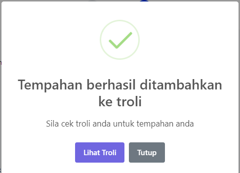

# Troli

- **Tujuan**: Membantu pengguna menyemak butiran tempahan dan menambah tempahan tersebut ke troli sebelum meneruskan ke pembayaran.

## Langkah-langkah

1.  Selepas melengkapkan borang tempahan, pengguna akan diarahkan ke halaman **Ringkasan Tempahan** yang memaparkan maklumat seperti kemudahan yang dipilih, tarikh, masa, tujuan tempahan, caj sewaan, caj cagaran, caj utiliti, dan pilihan persiapan.
    
2.  Semak semua butiran tempahan. Jika semua maklumat telah disahkan betul, klik butang **Tambah ke Troli** untuk menyimpan tempahan dalam troli.
    
3.  Notifikasi akan dipaparkan untuk mengesahkan bahawa tempahan berjaya ditambahkan ke troli. Pengguna boleh memilih untuk **Lihat Troli** atau **Tutup** notifikasi tersebut.
    

# Menyemak Troli dan Meneruskan Pembayaran

- **Tujuan**: Membantu pengguna menyemak tempahan dalam troli dan meneruskan ke pembayaran.

## Langkah-langkah

1.  Buka **Troli** untuk melihat semua tempahan yang telah ditambahkan. Setiap tempahan akan dipaparkan dengan butiran penuh seperti tarikh, masa, pilihan persiapan, dan jumlah bayaran.
    
2.  Untuk membatalkan atau menghapus tempahan dari troli, klik ikon **tong sampah** yang terdapat di sebelah kanan tempahan.
    
3.  Jika ingin menambah tempahan lain, klik **Buat Tempahan Baru** untuk kembali ke halaman pilihan kemudahan.
    
4.  Apabila semua tempahan telah disahkan, klik butang **Teruskan ke Pembayaran** untuk memulakan proses pembayaran.
    

## Pengendalian Ralat

- Pastikan jumlah dan butiran tempahan adalah tepat sebelum meneruskan ke pembayaran.
- Jika tempahan perlu diubah atau ditambah, gunakan pilihan yang disediakan dalam troli.
